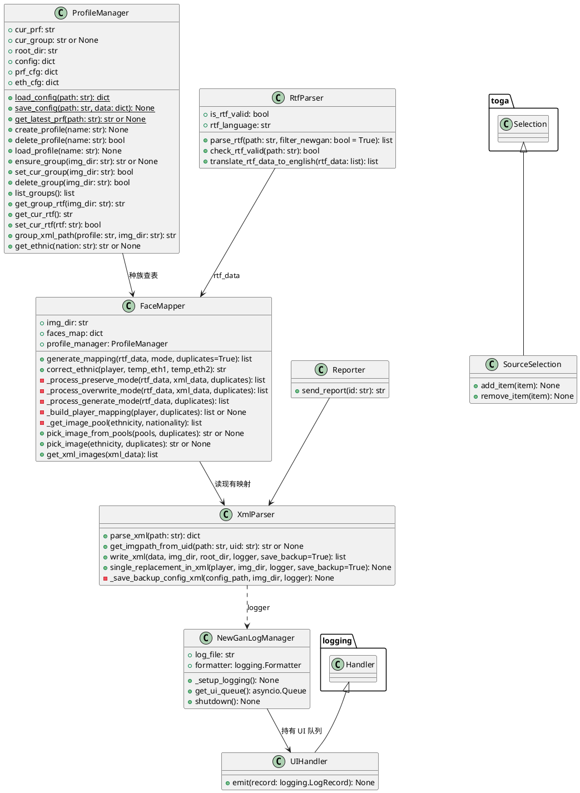
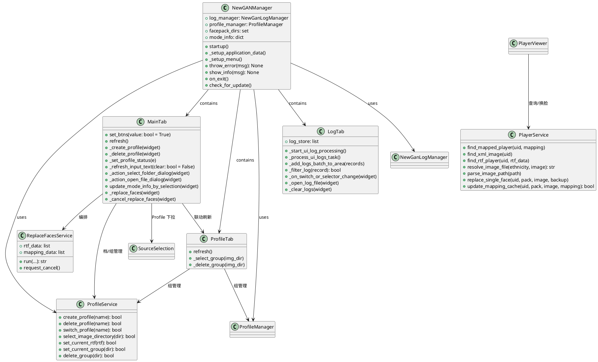

# NewGAN Manager 项目内部文档 / Project Overview

> 面向维护者的架构文档：模块与方法清单、替换流程、类图、配置文件用法。
> 使用者文档见仓库根目录 [README.md](../README.md)。

## Class Structure and Internal Methods / 类结构与内部方法

### Core Modules / 核心模块（`core/`）

#### ProfileManager（`core/ProfileManager.py`）
内置 JSON 读写工具（原 `ConfigManager` 已并入，`core/ConfigManager.py` 已删除）。
一个 Profile = 一个存档的一套独立配置，内部含多个「组」。**组以头像包目录（img_dir）为唯一标识**，
每组包含该目录对应的 RTF 名单与 config.xml 快照。

JSON 工具（静态方法）：
- `load_config(path)` — 读 JSON，文件缺失抛 `FileNotFoundError`；文件损坏（`JSONDecodeError`）时备份为 `path.corrupt` 后按缺失处理（调用方回退默认配置）
- `save_config(path, data)` — 原子写入：先写同目录 `path.tmp` 再 `os.replace` 替换（UTF-8、`ensure_ascii=False`、缩进 2），进程中断不会留下截断文件
- `get_latest_prf(path)` — 从 `.user/cfg.json` 的 `Profile` 字典中取值为 `true` 的名字（激活 Profile）

Profile 管理：
- `__init__(name, root_dir, data_dir=None)` — 加载 `.user/cfg.json`、`.user/<name>.json`、`.config/eth_cfg.json`，恢复当前组
- `create_profile(name)` — 登记 Profile、生成 `{"cur_group": null, "groups": {}}`，并切换过去
- `delete_profile(name)` — 删除注册、`<name>.json` 与映射备份目录；`No Profile` 不可删，返回 `False`
- `load_profile(name)` — 先保存旧档所有组的 `config.xml` 快照，再恢复新档各组的快照，更新激活位

组管理：
- `ensure_group(img_dir)` — 新头像包目录自动建组并设为当前组（选择目录 / Replace 前调用）
- `set_cur_group(img_dir)` / `delete_group(img_dir)` — 切换 / 删除组（删当前组时回退到剩余组的第一个）
- `list_groups()` / `get_group_rtf(img_dir)` / `get_cur_rtf()` / `set_cur_rtf(rtf)` — 组与 RTF 读写
- `group_xml_path(profile, img_dir)` — 组映射快照路径 `.user/<profile>/<sanitized_img_dir>.xml`
- `get_ethnic(nation)` — 英文三字码 → 种族目录名，查 `eth_cfg.json`

> 注意：写 `config.xml` 的责任在 `XmlParser`，`ProfileManager` 只负责各目录快照的保存/恢复（`load_profile` 内部完成，原 `swap_xml` 拆分后不再单独暴露）。

#### RtfParser（`core/RtfParser.py`）
- `parse_rtf(path, filter_newgan=True)` — 逐行按 `|` 切列，返回球员记录列表
- `check_rtf_valid(path)` — 读前 20 行判定格式，并识别语言（`English` / `简体中文`），设置 `is_rtf_valid`、`rtf_language`
- `translate_rtf_data_to_english(rtf_data)` — 按 `rtf_language` 用 `.config/nat_translation.json` 把第一/第二国籍译回英文三字码（结果带缓存 `_translation_cache`）

记录字段顺序：
`[0]UID [1]主要国籍 [2]第二国籍 [3]姓名 [4]发长 [5]发色 [6]种族码 [7]肤色码 [8]Face [9]俱乐部 [10]年龄 [11]身高 [12]体重 [13]是否随机人`

解析要点：
- 两套正则 `rtf_regex`（英文三字码国籍）与 `rtf_regex_chn`（中文国籍）；列数 < 7 跳过
- UID 非纯数字跳过；种族码不在 0–10 跳过
- UID 默认加 `r-` 前缀（随机人）；14 列且第 14 列为 `No`/`否` 时去掉前缀，并在 `filter_newgan=True` 时整条跳过
- 身高/体重列清理零宽空格 `U+200B`

#### XmlParser（`core/XmlParser.py`）
`config.xml` 的读写不使用 XML 库，而是模板 + 正则行替换。
- `parse_xml(path)` — 返回 `{uid: {uid, ethnicity, image}}`；`uid_regex` 兼容 `(r-)?\d{4,}`
- `get_imgpath_from_uid(path, uid)` — 按 UID 取 `种族/图片名` 路径
- `write_xml(data, img_dir, root_dir, logger, save_backup=True)` — 用 `.config/config_template` 的 `[players]` 占位生成全量 `config.xml`
- `single_replacement_in_xml(player, img_dir, logger, save_backup=True)` — `player = [uid, 目录名, 图片名]`，只替换匹配 UID 的那一行
- `_save_backup_config_xml(config_path, img_dir, logger)` — 生成 `config备份_YYYYMMDD-HHMMSS.xml`，只保留最近 10 份

#### FaceMapper（`core/FaceMapper.py`）
- `__init__(img_dir, prf_manager)` — 扫描 `img_dir` 一级子目录，建 `faces_map = {目录名: {图片名(不含扩展名)}}`
- `generate_mapping(rtf_data, mode, duplicates=True)` — 按模式分派；`Preserve` + 禁止重复时先从池中剔除 XML 已用图片
- `correct_ethnic(player, temp_eth1, temp_eth2)` — 用 FM 种族码在两个候选种族间修正归类：
  - `0`：Scandinavian > Caucasian > Central European
  - `1`：命中 Caucasian/EECA/Italmed/SAMed/SpanMed/YugoGreek/South American 之一，否则 Central European
  - `2`：MESA，否则 MENA
  - `3/6/8/9`：SAMed(6) / Seasian(8) / South American(3,9) 命中则用，否则 African
  - `4` → MESA，`5` → Seasian，`7` → South American
  - `10`：MESA > Seasian > South American > Asian
- `_process_preserve_mode` / `_process_overwrite_mode` / `_process_generate_mode` — 三种模式，前两种保留 XML 中未被处理的记录
- `_build_player_mapping(player, duplicates)` — 取种族 → 修正 → 校验在头像包内 → 选图，返回 `[uid, 种族, 图片名]`，失败返回 `None` 并写日志
- `_get_image_pool(ethnicity, nationality)` — 池顺序：**国籍同名目录 > 种族目录 > 两者都缺失时使用全部目录**
- `pick_image_from_pools(pools, duplicates)` / `pick_image(ethnicity, duplicates)`（后者兼容旧调用）
- `get_xml_images(xml_data)` — 提取 XML 已用图片名列表

#### NewGanLogManager（`core/NewGanLogManager.py`）
- `UIHandler.emit(record)` — 通过 `asyncio.run_coroutine_threadsafe` 把日志投递到 UI 队列
- `__init__(root_dir)` — 日志文件 `<app>/newgan.log`，10 MB × 3 备份，`DEBUG` 级，UTF-8
- `_setup_logging()` — `NewGAN App` logger → QueueHandler → QueueListener（文件 handler + UI handler）
- `get_ui_queue()` / `shutdown()`

#### SourceSelection（`core/SourceSelection.py`）— 继承 `toga.Selection`
- `add_item(item)` / `remove_item(item)` — 补齐 Toga 0.5 缺失的动态增删选项接口，供 Profile 下拉框使用

#### Reporter（`core/Reporter.py`）
- `send_report(id)` — 经 Discord webhook 上报某 UID 当前使用的头像
- 当前 UI 未接入（`app.py` 中的 webhook 地址已注释掉）

### Services / 业务服务层（`services/`）

与 UI 框架完全解耦的编排逻辑（**不 import toga**），由 UI 层构造并注入依赖：

- `ProfileService` — Profile（档）与组（头像包目录）的增删切管理：
  `create_profile` / `delete_profile` / `switch_profile` / `select_image_directory`（新目录自动建组）/
  `set_current_rtf` / `set_current_group` / `delete_group`
- `PlayerService` — 球员预览查询与单人换脸：
  `find_mapped_player` / `find_xml_image` / `find_rtf_player` / `resolve_image_file` /
  `parse_image_path` / `replace_single_face` / `update_mapping_cache`
- `ReplaceFacesService`（`services/replace_service.py`）— 替换流程编排（见下方 Data Flow）。
  错误提示与确认对话框通过构造注入的 `on_error` / `ask_confirm` 回调提供，UI 层传入
  `app.throw_error` / `app.ask_confirm`

分层约定：`app*.py`（UI）只负责控件、对话框与展示；业务规则收敛在 `services/`；
数据与算法在 `core/`。

### UI / 界面层

#### NewGANManager（`app.py`）— 继承 `toga.App`
- `__init__()` — 创建 `NewGanLogManager`，声明实例属性
- `startup()` — 装配数据 → 定义 `facepack_dirs`（14 个种族目录）与 `mode_info` → 建菜单 → 实例化 `ProfileService` → 建 Main/Profile/Log 三个标签 → 显示 1000×600 主窗口
- `_setup_application_data()` — 建 `.user/`、必要时由 `default_cfg.json` 复制 `cfg.json`、实例化 `ProfileManager`
- `_setup_menu()` — 帮助菜单：使用教程（YouTube + Bilibili）、Troubleshooting、FAQ、Discord
- `throw_error(msg)` / `show_info(msg)` / `ask_confirm(title, msg)` — 异步对话框，同时写日志；后两者供业务层注入
- `on_exit()` — 记录退出日志
- `check_for_update()` — 保留但未被调用，且指向的是上游仓库

#### MainTab（`app_main_tab.py`）
- `__init__(app)` — 自上而下区块：Create/Select/Delete Profile、Images Directory（当前组）、RTF File（当前组）、Mode + 三个开关、Replace Faces + 进度、Viewer；构造 `ReplaceFacesService` 并向其注入 `throw_error` / `ask_confirm`
- `set_btns(value=True)` — 按「档 → 当前组 → 当前组 RTF」三级状态控制按钮可用性
- `refresh()` — 刷新输入显示与按钮状态（Profile / 组变化后由各回调调用）
- `_create_profile` / `_delete_profile` / `_set_profile_status` — 委托 `ProfileService` 执行业务，操作后联动 `ProfileTab.refresh()`
- `_refresh_input_text(clear=False)` — 回填当前组的 img_dir / rtf
- `_action_select_folder_dialog` / `_action_open_file_dialog` — 对话框交互，业务交给 `ProfileService.select_image_directory`（新目录自动建组）/ `set_current_rtf`
- `update_mode_info_by_selection(widget)` — 切换模式时更新说明文字
- `_replace_faces` — 读取当前组参数，委托 `ReplaceFacesService.run` 执行（见下方流程）
- `_update_progress(status, value)` / `_cleanup_after_replace` — 进度条、状态文字与收尾
- `_cancel_replace_faces` — 请求 `ReplaceFacesService` 置位取消标志，工作线程逐球员中断

#### ProfileTab（`app_profile_tab.py`）
- `__init__(app)` — 显示当前 Profile 名 + 组列表（每个组一行：img_dir / rtf / Select / Delete）
- `refresh()` — 按当前 Profile 重建组列表（无组时提示从 Main 标签选择目录）
- `_select_group(img_dir)` / `_delete_group(img_dir)` — 组管理业务委托 `ProfileService`，操作后联动刷新 Main 标签

#### PlayerViewer（`app_viewer.py`）
- 底部预览区：按 UID 查询头像与球员资料、单人换脸，业务委托 `PlayerService`
- `_on_preview_uid_confirm` — 依次查 `mapping_data` → 当前组 `config.xml` → 加载图片 → 回填 RTF 球员信息
- `_replace_it` — 解析所选图片路径 → `PlayerService.replace_single_face` 写 `config.xml` → 同步内存映射缓存

#### LogTab（`app_log_tab.py`）
- `__init__(app)` — 顶部工具行（级别下拉、`only show this level` 开关、Open Log File、Clear Logs）+ 只读文本区
- `_start_ui_log_processing` / `_process_ui_logs_task` — 50 ms 窗口批量取队列（单批 ≤ 100 条）
- `_add_logs_batch_to_area(records)` — 过滤后批量拼接；内存 `log_store` 上限 10000 条，显示上限 8000 行，自动滚底
- `_filter_log(record)` — 按级别阈值或「仅该级别」判定
- `_on_switch_or_selector_change(widget)` — 条件变化时用 `log_store` 重绘整个文本区
- `_open_log_file(widget)` — Windows `os.startfile` / macOS `open` / Linux `xdg-open`
- `_clear_logs(widget)` — 只清显示区，不动 `log_store` 与文件

## Replace Faces 流程 / Data Flow

```text
MainTab._replace_faces
  └─ ReplaceFacesService.run(当前组的 rtf/img_dir + profile + mode)  可 Cancel
       0%  RtfParser.check_rtf_valid            ← 无效则终止
       10% ReplaceFacesService._validate_image_directory   ← 缺失目录询问创建
       20% RtfParser.parse_rtf (线程池)          →  rtf_data
            └─ translate_rtf_data_to_english    ←  中文 RTF 必走
       40% FaceMapper.generate_mapping (线程池)  →  mapping_data = [[uid, 种族, 图片名], ...]
       80% XmlParser.write_xml (线程池)          →  当前组 img_dir/config.xml（可选先备份）
       90% ProfileManager.save_config            →  .user/<Profile>.json（含各组的 rtf 等元数据）
      100% show_info("Finished! :)")
```

模式差异（`FaceMapper.generate_mapping`）：
- `Generate`：只用 RTF 结果，完全覆盖
- `Preserve`：跳过 `config.xml` 中已存在的 UID，其余映射原样保留
- `Overwrite`：RTF 内球员全部重抽，RTF 外球员保留原映射

## UML Class Diagrams / 类图

### Core Modules



### UI Modules



## Configuration File Usage / 配置文件用法

拆分为「静态映射表」与「用户/Profile 状态」两组，全部位于应用目录（`toga.App.paths.app`）：

| 文件 | 责任 | 读写方 |
| :--- | :--- | :--- |
| `.config/eth_cfg.json` | 国籍三字码 → 种族目录（`{"Ethnics": {"ARG": "SAMed", ...}}`） | `ProfileManager.get_ethnic` |
| `.config/nat_translation.json` | 中文国籍 → 三字码，解析中文 RTF 时使用 | `RtfParser.translate_rtf_data_to_english` |
| `.config/config_template` | `config.xml` 头尾模板，`[players]` 为占位符 | `XmlParser.write_xml` |
| `.user/cfg.json` | Profile 列表 + 激活位（首次运行从 `default_cfg.json` 复制） | `ProfileManager` |
| `.user/<Profile>.json` | 该 Profile 的组配置：`{"cur_group": <img_dir>, "groups": {<img_dir>: {"rtf": ...}}}` | `ProfileManager`、`MainTab` |
| `.user/<Profile>/<sanitized_img_dir>.xml` | 该档某组的 `config.xml` 快照，切换档时与头像包目录互换 | `ProfileManager.load_profile` |
| `newgan.log` | 运行日志，10 MB × 3 | `NewGanLogManager` |

## Improvements / 待改进

- **测试**：✅ 已完成基础断言（`test_rtf_parser.py`：英文 / 中文翻译 / 14 列 / 随机人过滤；`test_face_mapper.py`：correct_ethnic 0-10 全分支 / Generate 映射；`test_profile_manager.py`：原子写入 / 损坏回退），CI 以 `python -m unittest discover -s src/tests -p 'test*.py'` 运行。仍待补：映射另外两种模式、XML 读写与备份轮换、ProfileManager 组增删切与多目录快照交换。
- **CI**：✅ 已建 `.github/workflows/test.yml`（push / PR 触发 unittest，Python 3.12.10，`PYTHONPATH=src`，测试仅依赖标准库故不安装 requirements）。待补：artifact 版本号与 `version` 文件同步、`ruff check src/`。
- **更新检查**：`check_for_update()` 指向上游仓库，需要改为本分支 Release 并接入菜单。
- **报告功能**：`Reporter` 未接入 UI，webhook 地址需移入配置文件而非硬编码。
- **路径处理**：替换流程周边仍有 `str + "/..."` 拼接，建议统一为 `pathlib.Path` / `os.path.join`，以改善含空格、中文路径的兼容性。
- ~~**原子写入**：`save_config` 为直接覆盖写，进程崩溃会留下损坏 JSON。~~ ✅ 已实现（2026-09-01）：`save_config` 临时文件 + `os.replace` 原子替换；`load_config` 捕获 `JSONDecodeError` 时备份 `.corrupt` 后回退默认配置。
- **切换竞态**：替换任务运行中切换 Profile 会互相覆盖 `config.xml`，建议替换期间禁用 Profile 下拉与组删除。
