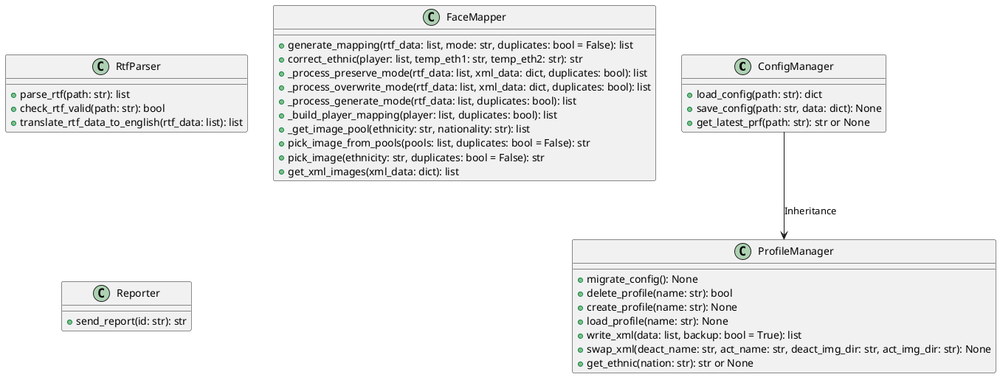
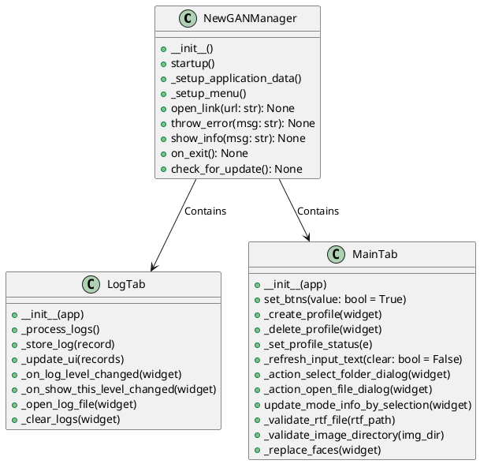

# NewGAN Manager Project Overview

## Class Structure and Internal Methods

### Core Modules

#### ConfigManager
- `load_config(path)`
- `save_config(path, data)`
- `get_latest_prf(path)`

#### ProfileManager
- `migrate_config()`
- `delete_profile(name)`
- `create_profile(name)`
- `load_profile(name)`
- `write_xml(data, backup=True)`
- `swap_xml(deact_name, act_name, deact_img_dir, act_img_dir)`
- `get_ethnic(nation)`

#### RtfParser
- `parse_rtf(path)`
- `check_rtf_valid(path)`
- `translate_rtf_data_to_english(rtf_data)`

#### FaceMapper
- `generate_mapping(rtf_data, mode, duplicates=False)`
- `correct_ethnic(player, temp_eth1, temp_eth2)`
- `_process_preserve_mode(rtf_data, xml_data, duplicates)`
- `_process_overwrite_mode(rtf_data, xml_data, duplicates)`
- `_process_generate_mode(rtf_data, duplicates)`
- `_build_player_mapping(player, duplicates)`
- `_get_image_pool(ethnicity, nationality)`
- `pick_image_from_pools(pools, duplicates=False)`
- `pick_image(ethnicity, duplicates=False)`
- `get_xml_images(xml_data)`

#### Reporter
- `send_report(id)`

### UI-APP

#### NewGANManager
- `__init__()`
- `startup()`
- `_setup_application_data()`
- `_setup_menu()`
- `open_link(url)`
- `throw_error(msg)`
- `show_info(msg)`
- `on_exit()`
- `check_for_update()`

#### LogTab
- `__init__(app)`
- `_process_logs()`
- `_store_log(record)`
- `_update_ui(records)`
- `_on_log_level_changed(widget)`
- `_on_show_this_level_changed(widget)`
- `_open_log_file(widget)`
- `_clear_logs(widget)`

#### MainTab
- `__init__(app)`
- `set_btns(value=True)`
- `_create_profile(widget)`
- `_delete_profile(widget)`
- `_set_profile_status(e)`
- `_refresh_input_text(clear=False)`
- `_action_select_folder_dialog(widget)`
- `_action_open_file_dialog(widget)`
- `update_mode_info_by_selection(widget)`
- `_validate_rtf_file(rtf_path)`
- `_validate_image_directory(img_dir)`
- `_replace_faces(widget)`

## UML Class Diagrams

### Core Modules

### UI-APP Modules

## Improvements in Testing

- Write better tests

## Configuration File Usage

- Use one configuration file for nation-to-ethnicity mapping and another for the last active profile
